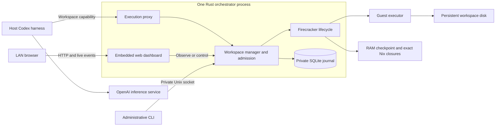
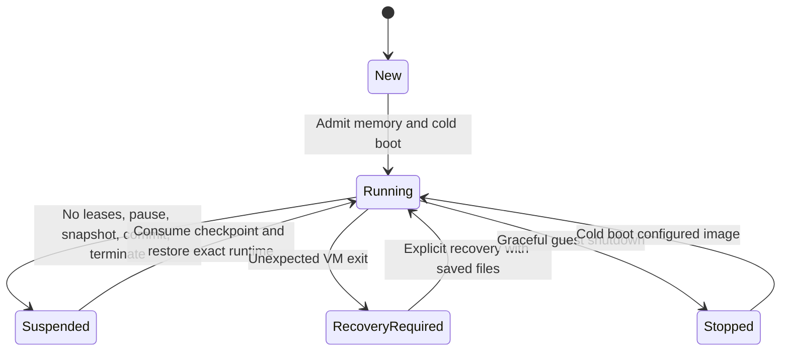

# Environment orchestrator

Run agent harnesses on the host. Give each harness an isolated Firecracker workspace for commands and files. Restore a suspended workspace when its agent needs a tool. Suspend the workspace after its work stops.

The service and VM controller use Rust. The CLI and Codex launcher use short-lived Python processes. Nix builds the service and its dependencies. NixOS builds the guest images.

## Architecture



The administrative API uses a private Unix socket. The execution gateway listens on loopback port 6090. Each workspace has a separate capability, disk, SSH key, executor session, and conversation directory. One harness can own a workspace at a time.

The mbp-agent deployment provides eight fixed workspace slots, including two existing demo workspaces. Each guest has two vCPUs, 3 GiB RAM, and a 64 GiB sparse persistent disk. The service can accept a different slot list. Automatic slot creation and recycling are later work.

The Codex launcher uses remote execution for shell, processes, files, patches, images, and project instructions. Bubblewrap hides host workspace files and credentials from the harness. It exposes immutable Nix tools, shared skills, and private conversation state. See [Codex routing](CODEX.md).

## Build and use

```sh
nix build
./result/bin/environment-vm status
./result/bin/environment-vm create swe-demo-a
./result/bin/environment-codex swe-demo-a
./result/bin/environment-vm suspend swe-demo-a
./result/bin/environment-vm resume swe-demo-a
```

These commands require a running service and configured guest slots. Creating a workspace and reading its status do not start its VM.

Machine-specific NixOS guest and network modules live in the private `mbp-agent-nixos` repository. That repository pins this source by commit. Import `package.nix` with `pkgs` and, optionally, a separate `codex` package.

| Setting | Default | Purpose |
| --- | --- | --- |
| `ENVIRONMENT_STATE` | `~/.local/share/environment-orchestrator` | Private database, disks, checkpoints, credentials, and conversations |
| `ENVIRONMENT_SLOTS` | `[]` | JSON array with `runner`, `firecracker`, and `guest_host` per slot |
| `ENVIRONMENT_PORT` | `6090` | Loopback execution gateway port |
| `ENVIRONMENT_WEB_ADDR` | `127.0.0.1:6091` | Dashboard listener; `off` disables it |
| `ENVIRONMENT_WEB_HOSTS` | Empty | Additional allowed HTTP hostnames or IP addresses, separated by commas |
| `ENVIRONMENT_IDLE_SECONDS` | `120` | Time without an execution lease before suspension |
| `ENVIRONMENT_HOST_RESERVE_MB` | `3072` | Host available-memory reserve before startup |
| `ENVIRONMENT_MEMORY_OVERCOMMIT` | `false` | Use startup headroom instead of a complete guest limit for admission |
| `ENVIRONMENT_STARTUP_HEADROOM_MB` | `512` | Additional available memory required with overcommit |
| `RUST_LOG` | `environment_orchestrator=info` | Service log filter |

The slot runner and Firecracker binary must exist in the Nix store. The host must provide KVM, writable TAP devices, guest routing, and access to the Nix daemon. The service wrapper supplies Nix-managed SSH and filesystem tools.

## Web dashboard

The dashboard uses the compact terminal style of Vitals. It provides workspace filters, resume and suspend controls, a workspace inspector, memory admission readings, six minutes of in-memory history, and the last 20 journal entries. It can allocate an unused configured slot. Allocation does not start its guest. Shutdown and recovery require confirmation because they discard the memory session.

Click a workspace name or Details to select it and bring its details into view. The details panel also has a workspace selector and controls for the selected guest. Hover over either graph to read a sample's time and values. Focus a graph and use Left, Right, Home, or End to inspect samples with the keyboard; Escape hides the tooltip. Live updates preserve workspace selection, focused controls, and graph interaction.

The dashboard runs inside the Rust service. Its HTML, CSS, and JavaScript are embedded at build time. It has no frontend server, framework, CDN, or external font dependency. One sampler updates all browsers every two seconds through server-sent events. Observation does not acquire an execution lease, start a guest, or reset its idle timer.

The default listener is local. The `mbp-agent` deployment exposes `http://192.168.50.203:6091` through its LAN interface. It treats LAN clients as administrators, like Vitals; it has no login. Allowed Host headers, same-origin control requests, and a content security policy restrict browser access. The dashboard does not expose workspace capabilities, guest shell execution, or the private administrative API. Add any new proxy hostname to `ENVIRONMENT_WEB_HOSTS` before using it.

Service memory is process PSS. Guest memory is each VMM's RSS. The guest memory bound comes from its image or saved checkpoint and differs from current RSS. The dashboard also shows the available-memory threshold for startup. Persistent disk and snapshot storage show allocated filesystem blocks. Snapshot files can remain while a guest runs; only a committed suspended checkpoint is valid for restore. History resets when the service restarts. The request journal remains on disk.

The read-only dashboard API is `GET /api/dashboard`. Live snapshots use `GET /events`. Dashboard control requests use `POST /api/workspaces` or `POST /api/workspaces/{id}/{resume|suspend|shutdown|recover}` with an exact same-origin `Origin` header and `X-Environment-UI: 1`. Control actions are recorded in the durable request journal.

## Suspension and recovery



Pending requests and running executor commands retain execution leases. An idle WebSocket does not retain a lease. The proxy answers initialized health probes without waking the guest. It retains the guest TCP connection across suspension.

The service pauses the guest and writes a full checkpoint. It synchronizes checkpoint files and the persistent disk before it commits the metadata. It terminates the VMM after that commit. Restore consumes the checkpoint before the guest can change its disk.

A checkpoint retains its exact guest and Firecracker closures through Nix GC roots. A service update does not replace the suspended guest image. Never change a suspended guest disk to apply an update.

Memory admission checks Linux available memory before starting a guest. The host deployment enables overcommit and requires the host reserve plus startup headroom; it does not reserve each complete guest limit. Without overcommit, the next guest limit replaces startup headroom. Startup is serialized. Requests can wait for up to 120 seconds. A client disconnect cancels queued work before startup.

Manual suspension rejects active requests and processes. Service shutdown cancels execution connections before it snapshots guests. Unconfirmed operations retain their lease for the executor's detached-session expiry. The journal records their results as unknown. The proxy never repeats them automatically.

Background processes that outlive their executor command have no independent lease. Suspension pauses them. Use another profile for uninterrupted services.

```sh
environment-vm recover swe-demo-b
environment-vm shutdown swe-demo-b
sudo systemctl restart environment-orchestrator
journalctl -u environment-orchestrator
```

Recovery applies to an unexpectedly terminated VM. It cold boots saved files and loses the previous memory session. A matching live orphan VMM blocks recovery. A lifecycle durability failure requires inspection before recovery.

A graceful service restart preserves workspace disks and suspended guest state. Existing harness connections close. Schedule service restarts between tasks.

## Data and later milestones

Keep the runtime directory private and outside Git. RAM checkpoints can contain credentials and unsaved work. Back up the complete suspended workspace, its credentials, metadata, and exact runtime references together.

The current guest image has an immutable Nix store. Add toolchains through its NixOS configuration until durable package installation exists. Automated image migration, maintenance queues, and agent update notices remain later milestones.

Shared read-only Gmail tools are available to allowed Paperclip companies through both managed harnesses, in every workspace profile. Configure the account once on the host with `environment-mail setup`; see [shared mail tools](docs/mail.md). The guest profiles include an unauthenticated `gh` CLI.

Paperclip discovery and the SSH Codex launcher are described in [Paperclip integration](docs/paperclip.md). Profile selection is described in [workspace profiles](docs/workspace-profiles.md). The [Claude frontend launcher](docs/CLAUDE.md) uses Sonnet 5.5 with guest MCP tools. Browser Use sharing and NAS backups remain later work. NAS backups must deduplicate shared image files and repeated workspace data. Do not create an independent full image copy for every agent. See the [PRD](docs/PRD.md) and [update design](docs/updates.md).

## Validation

`nix build` runs the Rust safety tests. [Test instructions](tests/README.md) cover the private API, real guest lifecycle, and resource measurements. Real guest checks can suspend, restore, or crash a selected test workspace.

Measure service PSS separately from guest RAM and checkpoint page cache. Cgroup memory includes reclaimable filesystem cache. It does not represent the service process footprint alone.

See [measured Rust results](docs/validation.md) for memory, latency, and live verification.
