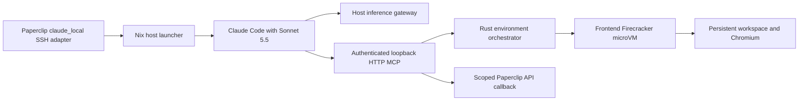

# Frontend SWE with Claude Code

The `environment-claude` launcher runs the Nix-managed Claude Code harness on the host. It uses the exact `claude-sonnet-5-5` model through `https://ai.h.mattre.id`. The launcher reads the existing private host inference key. It does not store that key in a guest, a Nix derivation, Paperclip, or Git.

```sh
environment-claude frontend-demo --print "Inspect the project and run its tests"
environment-claude frontend-demo --resume SESSION_UUID --print "Continue the task"
```

New workspaces use the `frontend` profile unless `ENVIRONMENT_PROFILE` selects another configured profile. The profile includes guest Chromium and `agent-browser` for browser tests. Workspace files and browser state live in the guest. Conversations live in a private host directory for that workspace. A lock prevents Claude Code and Codex from writing to the same workspace at the same time.



## Tool routing and isolation

The launcher disables every built-in Claude workspace tool with `--tools ""`. It supplies only its authenticated HTTP MCP server, with `--strict-mcp-config`. It uses bare mode, disables hooks and updates, and refuses caller flags that can change tool routing, providers, plugins, or host directories. Main and background model aliases resolve to the same exact Sonnet 5.5 model. No other Claude model is selected.

Bubblewrap mounts the Nix store read-only, the selected harness state directory, selected system networking files, and shared skills read-only. It does not mount the host root, project repositories, control socket, inference key file, or host home. An empty directory occupies the guest workspace path in the harness namespace. All project operations use guest tools.

| Tool | Behavior |
| --- | --- |
| `guest_exec` | Start Bash in the microVM; return output and a session process ID. |
| `guest_wait` | Read new output and wait for a command started in this session. |
| `guest_terminate` | Stop a command started in this session. |
| `guest_read` | Read a UTF-8 guest file. |
| `guest_write` | Create or replace a UTF-8 guest file. |
| `guest_image` | Inspect a guest PNG, JPEG, GIF, or WebP file. |
| `search_mail`, `read_mail` | Shared read-only Gmail access through a separate authenticated host bridge; see [mail setup](mail.md). |
| `paperclip_api` | Coordinate tasks through a scoped host callback, when launched by Paperclip. |

Relative paths use `/var/lib/agent/workspace`. Use `guest_exec` for patches, searches, test commands, and guest `agent-browser`. Use `guest_image` to inspect a guest screenshot. Guest processes start with an explicit small environment and no inherited host or executor environment. Neither the inference key nor the Paperclip run credential is included.

The HTTP MCP listener uses a random capability and binds only to loopback for the lifetime of a harness session. A tool-list or health request does not start a VM. The first workspace operation opens the existing authenticated executor WebSocket. This single writer connection supports idle suspension between operations. Active commands prevent suspension until they exit or are terminated. The connection fails closed after a disconnect or uncertain mutation; the launcher never replays a failed operation.

## Paperclip configuration

Use the existing `mbp-agent Firecracker` SSH environment and `claude_local` adapter. Set `engine` to `cli` for SSH targets. Paperclip defaults to ACP, which accepts sandbox targets only. Set the command to `environment-paperclip-claude`, model to `claude-sonnet-5-5`, and `adapterConfig.env.ENVIRONMENT_PROFILE` to `frontend`. Set public `metadata.environmentProfile` to the same profile because Paperclip masks environment values in discovery responses. Do not set a broad host `cwd`, `managedAiConnection`, or extra CLI arguments for Claude. Supply only a non-secret host-managed authentication marker in Paperclip if its adapter requires an API-key environment variable. The actual inference key remains on this host.

The wrapper accepts only valid company, agent, and run UUIDs for an enabled company. It accepts a scoped run credential from Paperclip. Remote SDK callback origins must be loopback HTTP origins with ports. The wrapper reads bounded, owned instruction assets only under the current staged run and passes their text into the isolated harness. It consumes Paperclip's staged `--add-dir` rather than granting access to that host directory. Paperclip also supplies native `--mcp-config` and `--strict-mcp-config` flags. The wrapper validates that their owned, bounded JSON file is inside the current run and contains only the default HTTP `Paperclip projects` and `Paperclip connections` servers at the configured Paperclip origin. It accepts only their Authorization header. It discards the native configuration and its tokens; the host's scoped `paperclip_api` tool supplies coordination instead. Custom servers, stdio commands, other origins, extra headers, settings overrides, and files outside the current run are rejected.

Paperclip session IDs continue to refer to the per-workspace host Claude history. Staged Claude credentials and settings are not imported into the harness. The host launcher determines provider routing and authentication. The `paperclip_api` tool accepts paths relative to `/api`, with an optional leading slash. Both `agents/me` and `/agents/me` use the same company and route restrictions. An unavailable cached agent record triggers discovery before the orchestrator refuses a new launch. This lets an immediate resume retain its existing workspace without waiting for the periodic poll.

## Validation

`test_claude.py` checks the option allowlist, disabled built-ins, private configuration modes, Bubblewrap mounts, staged instruction containment, HTTP capability enforcement, lazy guest startup, authenticated remote file and process RPCs, image transport, credential-free command environments, and no replay after an uncertain mutation. It uses an executor fixture and makes no inference requests.

The exact gateway model was separately tested with a minimal Anthropic `/v1/messages` request: HTTP 200, returned model `claude-sonnet-5-5`, reply `OK`, 141 input tokens and 4 output tokens. A model-list entry alone is not used as evidence of successful inference.

A real Nix Claude Code process then ran inside the Bubblewrap namespace with an authenticated HTTP MCP fixture and no VM. It returned `LAUNCHER_OK`, exit code 0, and no stderr. Its startup record confirmed the exact Sonnet model, a connected MCP server, and only the six guest MCP tools. No built-in Bash, Read, or Edit tool was exposed. The installed launcher then completed an actual frontend VM run with the exact model: 27.58 seconds, 10 guest tool calls, zero tool errors, exit 0, and empty stderr. It wrote and read a proof file, opened guest Chromium with `agent-browser`, clicked Increment, and inspected a screenshot showing counter `1`. It stopped the web server and browser, then suspended the guest. The guest had a 3072 MiB RAM bound and a 64 GiB logical disk. The four API credential variables and host configuration paths were absent. A subsequent warm restore reached readiness in 99.79 ms (Firecracker API: 80.09 ms).

Paperclip then launched the AIME `Frontend SWE` agent through the installed SSH wrapper. Successful run `b904a4b2-4c8e-4c1b-9399-bb83fa9fbc52` used only Sonnet 5.5. It completed in 27.07 seconds of wall time, including 23.162 seconds inside Claude. Its 10 tool calls had zero errors. It read the saved guest proof and tested another Increment page. It inspected counter `1`, then stopped Chromium and the temporary server.

The scoped tool read its identity and issue, then marked AIME-3 done. The agent returned to idle, and its VM ended suspended. The startup record exposed only the six guest tools and `paperclip_api`. Private evidence is `~/Docs/firecracker/paperclip-frontend-validation.json` with its screenshot.

The live test found four setup constraints: CLI engine selection, native staged MCP flags, optional leading slashes in API paths, and stale paused status during immediate resume. Earlier failed test runs remain in Paperclip history. The successful verification is separate from those records. The stale-status regression uses an HTTP fixture to check resume, deletion, reappearance, preserved workspace identity, and refusal of a fresh pause.

CLI contracts follow [Claude Code CLI reference](https://code.claude.com/docs/en/cli-reference) and [Claude Code environment variables](https://code.claude.com/docs/en/env-vars), checked against the installed Nix Claude Code 2.1.285 CLI. Package updates occur through Nix.
