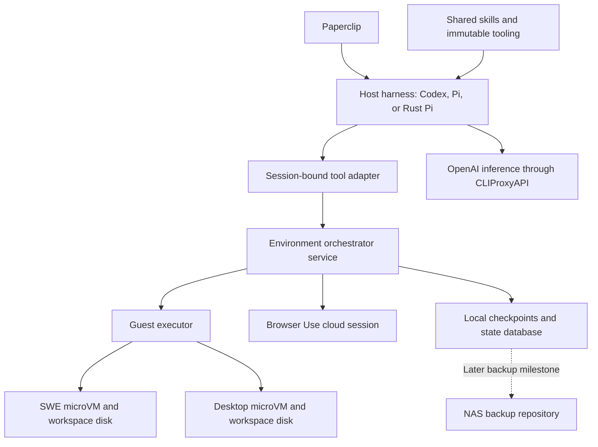
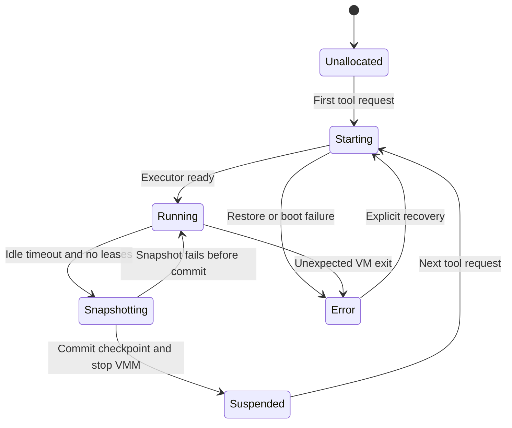
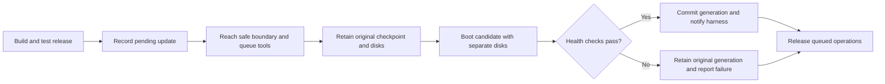
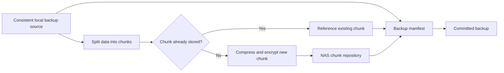

# PRD for resource efficient agent environments

Status: Draft · 2026-10-03

Implementation started. See [Initial environment orchestrator implementation](implementation.md) for the installed first release, measured results, and remaining milestones.

Build a local platform that runs many agent sessions on `mbp-agent`. Each task receives an isolated execution environment when it needs one. Paperclip coordinates work. A host harness sends filesystem and shell operations to Firecracker microVMs through an environment orchestrator. General internet browsing uses Browser Use cloud where practical.

## Why and vision

An agent should not require a desktop or development VM that runs continuously. Inference, external tools, and gaps between tasks can leave its environment idle. Browsers, desktops, and toolchains for every session would limit concurrency on this 16 GiB host.

Support many persistent agent identities and workspaces with fewer active environments. Preserve conversations on the host. Preserve guest files and application state through snapshots. Restore the assigned environment when an agent calls a tool.

Choose the harness from measured resource use and task results. TypeScript Pi is acceptable if it supports adequate concurrency. A Codex or Rust Pi fork is acceptable if its benefits justify its maintenance cost.

## Terms and scope

| Term | Meaning |
| --- | --- |
| Harness | The host program that manages inference, conversations, instructions, and tool calls. |
| Workspace | The persistent files and execution state for one project or task. |
| Environment orchestrator | The host service that allocates, starts, restores, suspends, and monitors environments. This replaces the earlier name “broker.” |
| Guest executor | The program inside a microVM that handles commands and filesystem operations. |
| Lease | A renewable record that prevents suspension while work needs the environment. |
| Checkpoint | Matching guest RAM, device state, persistent disks, and runtime references for local restoration. |
| Backup | An independent, retained copy that supports recovery after local data loss. |
| Admission control | The orchestrator policy that delays requests when host resources cannot support another active environment. |

Required:

- Run harness sessions on the host with OpenAI models through `https://ai.h.mattre.id`. Do not use Claude models.
- Integrate with Paperclip scheduling, sessions, logs, cancellation, and usage reports.
- Assign microVMs to workspaces. Restore them before tool execution. Suspend idle environments through snapshots and process termination.
- Share skills, immutable tooling, and service clients. Isolate writable files, conversations, credentials, and browser sessions.
- Use Browser Use cloud for general browsing. Use local `agent-browser` and development tooling when tasks require local application access.
- Build and install every local component through Nix, including custom forks.
- Manage environment updates through versioned releases, maintenance queues, and tested recovery. Preserve declared agent-installed packages.
- Add efficient NAS backups in a later milestone. Keep initial restore checkpoints on local storage.

Initial exclusions are multi-host scheduling, Kubernetes, a new orchestration UI, and CLIProxyAPI authentication changes. The initial system does not migrate running workspaces between incompatible guest builds.

## Architecture and ownership

| Component | Responsibility |
| --- | --- |
| Paperclip | Assign work, schedule runs, retain session references, and track results and costs. |
| Harness | Manage inference, conversation history, compaction, instructions, skills, and tool selection. |
| Tool adapter | Preserve tool behavior and send operations to the assigned environment. |
| Environment orchestrator | Manage workspace ownership, VM processes, networks, leases, checkpoints, resource limits, and recovery. |
| Guest executor | Execute commands and filesystem operations. Stream output and manage command sessions. |

Keep Paperclip agent IDs, harness conversation IDs, workspace IDs, and VM instance IDs separate. An agent can work on several tasks. Bind each execution environment to its company, project, and task workspace. Permit one writer per workspace initially. Use independent worktrees for concurrent tasks.

## Environment orchestrator service

Run one persistent systemd service on `mbp-agent`. Package the service and its configuration through Nix. The service remains available when all microVMs sleep. Paperclip manages agent work. The orchestrator manages execution environments.

The service must provide these operations through a private API:

- Create or resolve a workspace with a specified environment profile and image version.
- Execute a tool request in that workspace.
- Acquire, renew, and release a lease.
- Report environment state, resource use, active commands, and queue status.
- Suspend an idle environment.
- Stage an update and schedule workspace maintenance.
- Recover saved files after a crash that loses guest memory.
- Export specified artifacts.
- Delete a workspace only after an explicit request through an authorized administrative client.

A local Unix socket is the initial control interface. An MCP gateway can expose agent tools through this interface. Bind each client to authorized workspace IDs. Do not expose host administration as model tools. Give the VM process only the KVM and network access it needs. Use a restricted helper if network setup requires host privileges.

Persist workspace bindings, image versions, checkpoint manifests, lease records, and lifecycle transitions in a transactional database. SQLite is the initial proposal. Record the exact guest and Firecracker closures. Retain them with Nix GC roots while checkpoints depend on them.

Use a lock for each workspace. Combine concurrent restore requests into one restore operation. Admit operations across workspaces within host limits. Preserve request IDs and command handles across the tool adapter. Do not repeat a mutating operation automatically after a disconnect with an unknown result.

After a service restart, reconcile stored state with actual VM processes and checkpoint files. Reconnect to valid running instances where possible. Report an error when the service cannot establish a consistent state. Never apply an older RAM checkpoint to a disk that changed after that checkpoint.

## Tool contract

The harness must expose a coding tool contract that closely matches Codex:

| Tool or operation | Required behavior |
| --- | --- |
| `exec_command` | Accept the command, guest directory, environment, timeout, PTY setting, and output limit. Return output or a command-session handle. |
| `write_stdin` | Send input or poll output for the same command session. Return its exit status when it finishes. |
| `apply_patch` | Accept Codex-style patches. Check and apply them inside the guest. Report errors and changed files. |
| Filesystem access | Read, write, search, inspect metadata, and read images inside the guest workspace. Guest `rg` can implement searches. |
| Browser and desktop access | Return real screenshots and artifacts. Preserve task session identity. State capabilities that differ between providers. |

Preserve schemas, output formats, truncation, cancellation, directory handling, and command lifetimes wherever possible. Matching names alone does not establish compatibility. Tool compatibility also does not guarantee equivalent model behavior.

Route all model-invoked workspace operations into the guest. This includes shell-based file access, Git operations, patches, and helper scripts. Read the guest workspace’s `AGENTS.md` and skills during instruction discovery. Do not execute these operations on the host if the guest fails.

Tell the model which tools target the guest and which tools use shared services. Export guest artifacts only through explicit orchestrator operations. Do not grant arbitrary host filesystem access through artifact exports.

## Environment profiles

| Profile | Contents | Policy |
| --- | --- | --- |
| SWE | Minimal NixOS, Git, search, project toolchain, and test tools. Add headless Chromium and `agent-browser` when needed. | Default for coding. No XFCE required. |
| Desktop | Existing agent-desktop guest with XFCE, Chromium, desktop MCP, and a human viewer. | Allocate for graphical work. |
| Cloud browser | Browser Use session with task-specific browser state. | Default for general internet work. No local browser process. |

Version profiles as Nix closures. Use pinned Nix development environments for project dependencies where practical. Share immutable images and tooling. Give each instance separate writable disks, credentials, network identities, and browser state.

Prepared templates can reduce startup work. Template clones must receive separate identities, entropy, and writable disks before concurrent execution.

A cloud browser cannot directly access a development server in a private guest. Use a guest-local browser initially. Consider explicit tunnels later. Cloud session expiry differs from VM suspension. Do not promise live browser memory after the provider ends a session.

## Lifecycle and resource control

For each tool request, the orchestrator follows this sequence:

1. Check the client’s workspace permission.
2. Apply admission control.
3. Acquire a lease.
4. Restore or start the environment if necessary.
5. Execute the requested operation.
6. Return the result or command handle.
7. Release the lease when the operation no longer needs the environment.

An open MCP connection or Paperclip heartbeat does not prevent suspension. Active calls, command sessions, explicit background leases, and human viewers prevent suspension. Leases renew and expire. Completion and cancellation release leases. Detached jobs require a registered lease if they must continue. Otherwise, suspension pauses them. Configure the idle timeout per profile.

During suspension, pause guest CPUs. Create a checkpoint with matching disks. Commit its manifest before stopping Firecracker. Mark the checkpoint consumed before guest execution resumes. Keep mapped checkpoint files until the dependent VM process exits. After an unexpected crash, cold boot saved files only through explicit recovery. Report the loss of unsaved memory.

Admission control accounts for harnesses, guests, browsers, Paperclip, existing host services, and snapshot I/O. Use conservative guest memory bounds plus a host reserve initially. Guest RAM has a fixed guest-visible limit. Host pages load on demand, but an active guest can approach that limit.

Queue excess requests with visible status and timeouts. Limit simultaneous snapshots and restores. Enforce storage quotas and checkpoint retention. Persist inactive conversations so harness processes can exit between Paperclip runs. Historical agent identities do not require resident processes.

## Harness selection

Compare candidates with the same OpenAI model, tasks, tools, and environment backend:

| Candidate | Reason to evaluate | Required checks |
| --- | --- | --- |
| Codex or a small fork | Existing coding harness with remote executor and filesystem abstractions. | Complete guest routing, orchestrator integration, and host resource use. |
| Regular Pi | Extensible tools, RPC/SDK interfaces, and an existing Paperclip adapter. | Codex-like tool behavior and Node resource use under concurrency. |
| Fork of `pi_agent_rust` | A native runtime may reduce memory and startup costs. | Tool adaptation, provider compatibility, Paperclip integration, and maintenance cost. |

Compare task success, latency, token use, memory, and maintenance burden. Do not assume Rust uses less memory for this workload. Keep orchestrator APIs independent of the harness. Prefer an existing execution interface before maintaining a substantial fork.

## Paperclip integration

Use an existing Codex or Pi adapter with an orchestrator-aware launcher where it preserves the tool contract. Otherwise, provide an external adapter package. Keep the harness on the host. Running the entire harness inside a Paperclip sandbox does not satisfy this requirement.

The adapter must pass task context and scoped credentials. It must retain harness session references and workspace bindings. It must stream logs and tool activity. It must return outcomes and provider-reported token usage. It must handle cancellation and timeouts. Label estimated costs when the inference proxy cannot report actual cost.

Cancellation stops the agent’s commands and releases its leases. It does not delete the workspace. A later Paperclip run resumes the assigned conversation and workspace.

## Updates and agent-installed packages

The orchestrator owns infrastructure updates. Agents own project dependency changes and save task state before disruptive maintenance. Build updates in the background. Activate them at a declared task boundary.

| Update class | Default behavior |
| --- | --- |
| Host, VMM, and orchestrator | Use the platform release process. Check checkpoint and protocol compatibility before replacing a runtime. |
| Harness and shared skills | Change versions between runs or turns. Refresh instructions before continued execution. |
| Guest OS and executor | Build a tested image. Replace the workspace generation through a controlled cold boot. |
| Agent-installed packages | Preserve recorded Nix closures, profile generations, and manifests. Do not upgrade them silently with the base image. |
| Project dependencies | Preserve lockfiles. Change them through an explicit task. |

A suspended checkpoint contains the old kernel and processes. Do not replace its disks or edit its RAM to apply an update. Stage the new image while the workspace sleeps. Preserve the old image until its checkpoint expires.

Routine updates wait for a task boundary and active leases to finish. A suspended desktop can still contain unsaved work. Defer replacement if the system cannot establish a save boundary. Urgent updates require a deadline and an explicit policy for forced termination.

During maintenance, queue workspace operations only. The host harness can continue inference and use unrelated services. Return maintenance status when a wait exceeds the normal tool budget. Expired or cancelled requests must not execute later. Do not repeat operations with unknown results.

Before promotion, preserve matching rollback disks and a checkpoint. Test the candidate with separate writable disks and restricted external side effects. Commit the new generation only after package and health checks pass. Do not assume a Nix rollback reverses application migrations or later file writes.

The current desktop has a read-only store. A SWE profile must provide persistent Nix package state or reconstruct it from recorded closures. Store contents, package registrations, profiles, and GC roots must remain consistent after reboot. The microvm.nix documentation warns that a writable overlay alone can lose package database registrations. Treat durable agent installs as a feature to test, not an existing guarantee. [Writable store documentation](https://microvm-nix.github.io/microvm.nix/shares.html)

Provide a package tool that records the requested flake, resolved revision, package attribute, closure, and profile generation. Preserve workspace manifests and lockfiles. Import dependencies that existed only in an old image before promoting the candidate. Unresolved installs block promotion rather than disappearing silently.

Notify the harness before its next workspace operation. Include old and new versions, changed packages, restart status, and invalidated command handles. Check the expected generation on tool requests. Preserve the conversation, but refresh environment assumptions after replacement.

Promote a canary before wider updates. Limit concurrent builds and migrations. Retain old closures and rollback disks under bounded policies. A first access after maintenance can exceed the warm restore target.

Research and detailed procedures are in [Environment update policy and research](updates.md). The proposal draws from SnapStart initialization, Codespaces persistence, Fly Machines updates, and microvm.nix deployment. It does not assume their mechanisms preserve our live desktop sessions.

## NAS backups in a later milestone

Local checkpoints support fast restoration. NAS backups support recovery after host or disk loss. Initial tool requests must not depend on NAS availability. A NAS restore copies required data to local storage before starting the environment.

Store each immutable image or Nix closure once per version within the backup scope. Store mutable disks and optional RAM checkpoints through a repository that deduplicates chunks across workspaces and backup versions. A chunk is a piece of data identified by its content. Manifests reference existing chunks instead of storing another complete copy.

Do not copy a running writable disk with an unrelated RAM snapshot. Suspend the environment before creating the backup source. Pin its matching files until backup finishes. Alternatively, create an immutable local copy while suspended, then resume execution before upload. Use sparse copies or filesystem clones where the filesystem supports them.

A backup manifest must reference the disks, device state, optional RAM state, guest image, Firecracker version, and required secrets. Retain the referenced closures or their exact Nix archive data. Record platform and CPU compatibility requirements for restoring RAM state. Commit a backup only after every referenced object reaches the NAS.

Evaluate Borg, restic, or an equivalent repository before building a custom format. Require deduplication across files and backup versions within an authorized scope. Deduplicate plaintext chunks before repository compression and encryption. Preserve sparse disks on restoration. Do not precompress each complete image as a separate archive.

Separate file recovery from exact session recovery. File backups protect repositories and profiles without retaining RAM for every version. Exact session backups retain a matching checkpoint. Unique RAM contents and changed disk blocks still consume storage. Measure this cost instead of assuming a fixed deduplication ratio.

Optional incremental checkpoints require their complete base chain. Retain every referenced base until no checkpoint or backup needs it. Compare this approach with full checkpoints in a chunk repository. Choose from measured storage, backup I/O, and recovery time.

Configure retention and quotas by workspace. Delete only unreferenced chunks after applying retention. Protect backups against deletion by guest agents. Encrypt credentials and RAM contents. Use separate repositories or keys when company boundaries require separation.

Acceptance for this milestone requires a host-loss restore drill. Repeated unchanged backups must reuse existing chunks. Measure new stored bytes after controlled workspace changes. Report deduplication scope, compression, backup time, and restore time. Set numeric storage targets after tests with representative disks and RAM checkpoints.

## Validation and acceptance

The desktop prototype restored to readiness in approximately 127–137 ms with warm cache. A 3 GiB full snapshot and process termination took approximately 2.2 seconds. Cold desktop boot took approximately 7 seconds. These are individual observations, not fleet percentiles or SWE measurements.

Initial acceptance requires these results:

1. A host agent reads, patches, and tests a repository inside a guest. Evidence shows no model-invoked workspace writes on the host.
2. Two agents use separate workspaces concurrently without mixing routes, writable disks, or conversations.
3. Idle suspension stops the VMM process. The next call restores state. Active leases prevent suspension. An idle MCP connection does not.
4. Orchestrator restart and VM failure produce consistent recovery results. An unknown command result does not trigger automatic duplicate execution.
5. Paperclip schedules, observes, cancels, and resumes an agent with the assigned conversation and workspace.
6. Browser Use completes a public-site task. A guest-local browser tests a local application. Neither task requires the desktop profile.
7. Nix builds and installs all local components. Secrets remain outside Git and reach only the services that need them.
8. Agent-installed packages survive reboot and image replacement. Maintenance queues respect cancellation. Failed updates retain consistent rollback state and notify the harness.

Benchmark 1, 10, 25, and 50 logical sessions. Increase active environments only within admission limits. Measure aggregate PSS and cgroup memory, idle CPU, process count, queue time, task success, and token use. Measure p50/p95 tool latency, restore latency, snapshot I/O, and stored bytes.

PSS counts shared memory proportionally. Include filesystem cache and cgroup effects. Test long conversations, warm and cold cache, concurrent restores, and sustained load. Distinguish active sessions from persisted sessions.

Aim for approximately 100 ms warm restoration. Report complete tool latency separately. Set final concurrency and memory targets from measurements. A different harness must pass tool-contract checks and task-quality tests before it becomes the default.

## Milestones and open decisions

1. Prove host-harness and guest-tool routing with the existing VM and Codex executor.
2. Add the SWE profile and environment orchestrator service. Implement workspace ownership, leases, resource limits, and crash recovery.
3. Integrate Paperclip and Browser Use. Demonstrate two isolated agent workflows.
4. Evaluate Codex, Pi, and Rust Pi against the same tools and benchmark tasks.
5. Add versioned updates, package persistence, maintenance queues, and tested rollback. Check agent awareness after replacement.
6. Choose the default harness. Tune template cloning, idle policies, and host budgets.
7. Add NAS backups with chunk deduplication, retention, quotas, and tested recovery.

Open decisions include the default harness, supported toolchains, idle timeouts, and resource budgets. Update policies also need a cadence, deferral limits, security deadlines, and data migration rules. The NAS milestone also needs a storage protocol, backup format, recovery targets, and deduplication scope. Base these decisions on measurements and the NAS capabilities.

## References

- [Existing Firecracker notes](README.md), [browser demonstration evidence](screenshots/demo-results.json), and [update research](updates.md).
- [Codex source](https://github.com/openai/codex), [environment configuration](https://github.com/openai/codex/blob/main/codex-rs/exec-server/src/environment_toml.rs), and [filesystem abstraction](https://github.com/openai/codex/blob/main/codex-rs/file-system/src/environment_accessor.rs).
- [Pi](https://pi.dev/) and [Rust Pi](https://github.com/Dicklesworthstone/pi_agent_rust). Rust Pi does not currently target strict TypeScript Pi compatibility. Check compatibility during evaluation.
- Paperclip [external adapters](https://github.com/paperclipai/paperclip/blob/master/docs/adapters/external-adapters.md), [Codex adapter](https://github.com/paperclipai/paperclip/tree/master/packages/adapters/codex-local), and [Pi adapter](https://github.com/paperclipai/paperclip/tree/master/packages/adapters/pi-local).
- Browser Use [remote browsers](https://docs.browser-use.com/open-source/customize/browser/remote) and [API authentication](https://docs.browser-use.com/cloud/api-reference).
- [Borg repository internals](https://borgbackup.readthedocs.io/en/stable/internals.html) and [restic chunk deduplication](https://restic.net/blog/2015-09-12/restic-foundation1-cdc/).

Writing follows the [installed ASD-STE100 skill](/home/agent/.codex/skills/asd-ste100/SKILL.md). The document uses its structural rules and plain-word guidance. It does not claim compliance with the official ASD dictionary.
