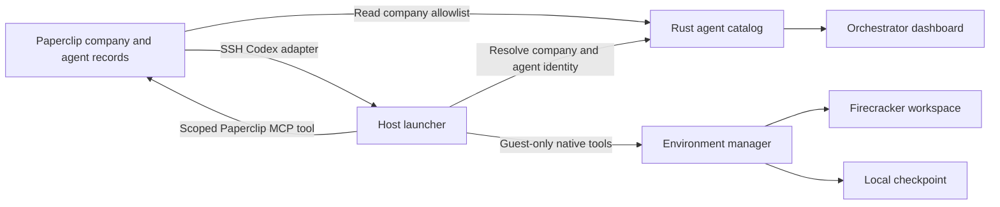

# Paperclip agents and Firecracker workspaces

Paperclip owns agent creation, permissions, tasks, and scheduling. The orchestrator discovers agents from explicitly configured companies every ten seconds. The dashboard shows their Paperclip status separately from their local VM state. Discovery does not allocate a VM slot or acquire an execution lease.



Store `paperclip.json` in the private runtime directory. It contains an HTTPS origin, a company allowlist, and the path to a private login JSON file. Both files must be owned regular files with mode 0600. Login credentials stay outside Git and the guest. The catalog retains a session cookie in memory and authenticates again after session expiry. Redirects are disabled. Failed sync retains the last known records and marks them offline.

```json
{
  "base_url": "https://paperclip.example",
  "login_file": "/private/paperclip-login.json",
  "companies": [{"id": "COMPANY_UUID", "name": "Company", "prefix": "COMPANY"}]
}
```

The login file contains `email` and `password`. The dashboard exposes selected identity fields only. It does not expose credentials, adapter configuration, or upstream response bodies. Removed agents retain their workspace binding and saved files. They cannot start new execution through the binding endpoint.

The private Unix API resolves a workspace with `POST /paperclip/companies/{company}/agents/{agent}/workspace`. It allocates one configured slot on first use. Repeated requests return the same workspace. Full capacity returns an error without deleting another workspace. Paused, pending, terminated, and removed agents cannot allocate a workspace.

Configure Paperclip's SSH environment to connect to the host. Configure its `codex_local` adapter command as `environment-paperclip-codex`. The adapter sends its company, agent, run identity, prompt, and scoped run credential. The wrapper preserves Codex JSON output and session arguments. It discards the adapter's known permission overrides. It rejects provider, directory, and unsupported configuration overrides. The existing launcher owns inference and workspace routing.

Paperclip's Codex authentication check needs a managed secret reference. Use a compatibility marker for this command, rather than copying the host inference credential to Paperclip. The wrapper uses the host's private inference credential. A normal Codex command cannot use the marker for inference.

The wrapper installs a small stdio MCP tool in its private harness configuration. This tool calls the configured Paperclip origin with the agent's scoped run credential. Paperclip checks company access and permissions. The tool blocks credential-management endpoints and adds the run identity to requests. The guest receives neither the Paperclip run credential nor the host inference credential through normal shell execution.

[Head of Hiring instructions](../agents/head-of-hiring.md) define the initial hiring role. Creating new agents does not reserve memory. Their first execution resolves a workspace and starts or restores its guest. Infrastructure updates and automatic slot recycling remain separate milestones.
