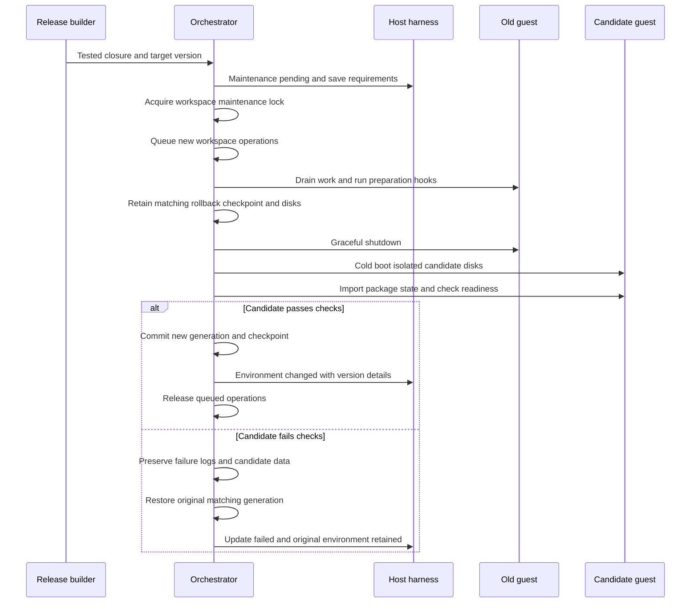

# Environment update policy and research

Status: Proposed design · 2026-10-03

The environment orchestrator should own infrastructure updates. Agents should declare project dependencies and prepare task state when maintenance requires it. Agents should not run unattended fleet upgrades. Build updates separately from activation. Apply updates at an explicit boundary between tool operations.

## What similar systems do

| System | Documented behavior | Proposed use in this platform |
| --- | --- | --- |
| AWS Lambda SnapStart | AWS patches saved environments and re-runs initialization for updates. It provides hooks before snapshots and after restoration. | Generate fresh checkpoints from updated environments. Use deterministic hooks for connections and temporary credentials. |
| GitHub Codespaces | Rebuilding replaces container state but preserves the designated workspace directory. | Separate durable workspace data from replaceable system images. Declare which agent-installed state survives. |
| Fly Machines | Image changes reboot running Machines. Updates can leave stopped Machines stopped. Leases and version checks coordinate changes. | Stage updates without waking every workspace. Lock each transition and check the expected environment version. |
| microvm.nix | Deployment can activate a system through SSH or restart its VM service. Writable store overlays require careful package database handling. | Use Nix closures for releases. Test guest package persistence before promising durable installs. |
| NixOS | Previous system generations support configuration rollback. | Retain old image closures, but also preserve matching application data for rollback. |

These patterns inform the proposal. They do not establish that our stateful desktops can accept the same update mechanisms. See the primary sources below.

## A suspended session still runs the old software

A Firecracker checkpoint preserves guest RAM and device state. Restoring it continues the old kernel and processes. Replacing disk files does not replace those processes. It can also break their relationship with stored data.

Do not patch checkpoint RAM or replace its backing image during suspension. Keep the original closure and disk generation until that checkpoint expires. Build the next image while the guest sleeps. Activate it through a cold boot or an explicitly tested live procedure.

A base-image update does not preserve unsaved RAM automatically. Desktop work needs a save boundary before replacement. A checkpoint alone does not prove that an editor saved its contents to disk. If the save boundary is unknown, defer routine updates and keep the original session available.

## Separate update classes

| Class | Owner | Default policy |
| --- | --- | --- |
| Host kernel, KVM, and Firecracker | Host release process | Schedule host maintenance. Retain checkpoint-compatible VMM versions where host compatibility permits. |
| Orchestrator, harness, and shared skills | Platform release process | Preserve database/protocol compatibility. Change harness and skill versions between runs or turns. |
| Guest OS and executor | Environment orchestrator | Build, test, then replace the guest generation during maintenance. |
| Agent-installed Nix packages | Agent requests, orchestrator records | Preserve resolved closures and profiles. Update separately from the base image. |
| Project toolchains and dependencies | Project manifest and task agent | Preserve lockfiles. Change dependencies through an explicit project task. |
| Temporary credentials and connections | Executor restore hooks | Refresh or reconnect after restoration without changing the project dependency set. |

A base-image update must not silently run `nix profile upgrade` against all agent profiles. Pinned project dependencies can remain old by design. Report vulnerable or unavailable dependencies through a separate maintenance task.

## Preserve agent-installed packages

The current desktop has a read-only system store. The proposed SWE profile needs an explicit installation mechanism. Keep Nix as the package source.

Provide a package tool that records the requested flake, resolved revision, attribute, closure, and profile generation. Prefer a workspace flake with a lockfile for dependencies that the task needs repeatedly. Capture direct Nix profile changes in the workspace inventory. Mark unrecorded installs as unresolved instead of silently discarding them.

Preserve these parts together:

- The writable Nix store or exported package closures.
- The Nix database and registrations for those closures.
- Profiles, generations, and GC roots.
- Package manifests and project lockfiles.
- User configuration and explicitly durable application data.

microvm.nix documents a writable overlay, but warns that package registrations can disappear after reboot. Persisting its files alone does not satisfy this requirement. The implementation must test package execution and database consistency after cold boot and base-image replacement. [microvm.nix writable store documentation](https://microvm-nix.github.io/microvm.nix/shares.html)

Do not reuse an old overlay blindly with a different base image. A profile can reference packages that existed only in the old image. Import or reconstruct all required closures and registrations in the candidate generation. Missing dependencies block promotion. Retain the old generation until the candidate passes checks.

Keep agent-owned data under declared persistent mounts. List disposable caches separately. System images, package data, and workspace data must have separate version records. NAS backups must include required custom closures and package metadata.

## Maintenance procedure

Use a persistent update record with the old generation, target generation, phase, deadline, and result. Keep build jobs within CPU, RAM, and I/O limits.

For an eligible workspace, follow these steps:

1. Build the candidate image without changing the active environment.
2. Test the image in a separate environment with restricted external side effects.
3. Announce maintenance and its save requirements.
4. Acquire the workspace maintenance lock.
5. Stop admitting new workspace operations.
6. Drain active calls and leases according to the update policy.
7. Run deterministic preparation hooks in the old guest when necessary.
8. Preserve a rollback checkpoint with separate, matching disks.
9. Shut down the old guest gracefully.
10. Create candidate disks from the consistent durable state.
11. Boot the candidate with the new image.
12. Import package state and run health checks.
13. Commit the new generation only after checks pass.
14. Notify the harness before the next workspace operation.
15. Release queued operations.

Do not attach the same writable disk to the old and candidate guests simultaneously. Candidate checks must not publish changes or repeat the agent’s external actions. Disk migrations run only against the candidate copy.

Retain the old matching disks and closure for rollback. A Nix generation rollback does not undo database migrations or edits to application files. After promotion, rollback must account for new writes. Never silently replace current files with an older backup.

A suspended workspace can remain suspended with an update pending. Prefer scheduled preparation after a known save boundary. The next access can trigger maintenance if it was not prepared earlier. That access can take longer than the normal warm restore target.

## Queueing and agent awareness

Routine updates wait for a task boundary. Active commands and viewers can defer them. An unattended workspace can update automatically only when its policy establishes a safe boundary. Security updates can have deadlines, but forced termination requires an explicit operator policy.

During maintenance, the harness can continue inference and use unrelated shared services. Queue only operations that require the affected workspace. Return a maintenance handle and status when the wait exceeds the normal tool-call budget. Do not make the model poll in a tight loop.

Queued requests retain request IDs, ordering requirements, timeouts, and cancellation. A cancelled or expired request must not execute later. Repeat only requests that definitely did not execute. An operation with an unknown result requires reconciliation.

Include the expected generation in workspace operations. Reject stale generation-dependent command handles after replacement. Return a specific `environment_changed` result. Require the harness to process the change before it issues another workspace operation.

The change event includes old and new versions, package changes, restart status, lost process handles, and migration results. Refresh environment instructions before the next turn or tool call. Preserve the host conversation, but do not let old assumptions silently target a different environment.

An agent can save files, stop a development server, or write a resume plan before maintenance. Preparation cannot depend on an LLM call for every update. Deterministic hooks handle ordinary service state. Unknown desktop state requires a separate save decision.

## Platform rollout and checks

Promote one canary before updating multiple workspaces. Bound simultaneous migrations and restores. New workspaces use the approved image. Existing workspaces retain their current generation until maintenance succeeds.

Keep current, target, and rollback versions visible in Paperclip and orchestrator status. Record update history and deferrals. Apply maximum deferral and retention policies so obsolete images do not accumulate indefinitely.

Test these cases before automatic updates:

- An agent-installed package survives cold boot and base-image replacement.
- A package references dependencies from the old image.
- An active command or viewer postpones routine maintenance.
- A request arrives during maintenance. Its timeout expires or the client cancels it.
- The orchestrator crashes during disk copying or generation promotion.
- A candidate fails health checks or changes an application schema.
- A restored harness holds stale command handles or environment assumptions.
- A rollback encounters files written after promotion.
- A local or NAS backup retains every required image and custom package closure.

Initial policy decisions remain open: update cadence, maximum deferral, security deadlines, and maintenance timeouts. Also choose which profiles support live package activation. Default base-image updates use controlled replacement, not live OS switching.

## Primary sources

- [AWS SnapStart updates and initialization](https://docs.aws.amazon.com/lambda/latest/dg/snapstart.html) and [runtime hooks](https://docs.aws.amazon.com/lambda/latest/dg/snapstart-runtime-hooks.html).
- [GitHub Codespaces rebuild and persistence](https://docs.github.com/en/codespaces/developing-in-a-codespace/rebuilding-the-container-in-a-codespace).
- [Fly Machines update, leases, and version controls](https://docs.fly.io/machines/api/machines-resource).
- [Firecracker snapshot state and disk ownership](https://github.com/firecracker-microvm/firecracker/blob/main/docs/snapshotting/snapshot-support.md).
- [microvm.nix deployment](https://microvm-nix.github.io/microvm.nix/ssh-deploy.html) and [writable store limitations](https://microvm-nix.github.io/microvm.nix/shares.html).
- [NixOS configuration rollback](https://nixos.org/manual/nixos/stable/#sec-rollback).
